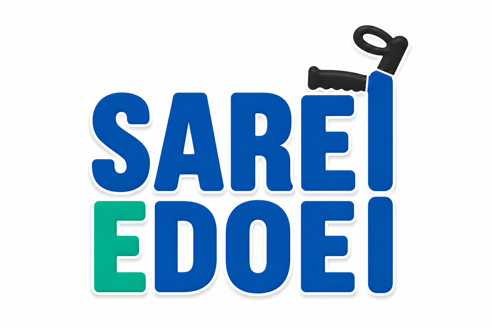

<div align="center">
  
  <br/>
  <br/>

  <strong>Plataforma solidária de empréstimo e doação de equipamentos médicos de apoio.</strong>

  <br/>
  <br/>

  [](https://github.com/lightguardian/sarei-e-doei/actions/workflows/ci.yml)
  [](https://github.com/lightguardian/sarei-e-doei/actions/workflows/ci.yml)
  
  
  
  

  <br/>

  🔗 **[Produção em breve]** &nbsp;·&nbsp; 📋 **[Kanban em breve]** &nbsp;·&nbsp; 📖 **[Swagger em breve]**

</div>

---

## O Problema

O empréstimo e doação de equipamentos médicos de apoio — muletas, cadeiras de rodas, andadores, camas hospitalares — acontece hoje de forma totalmente manual: via WhatsApp, ONGs presenciais e formulários físicos. Não existe uma plataforma digital centralizada, aberta e acessível para isso.

## A Solução

O **Sarei e Doei** conecta quem tem equipamentos parados em casa com quem precisa deles temporariamente. Quem sarou, doa. Quem precisa, solicita. Com fila gerenciada, chat direto entre doador e receptor, e histórico de transferências.

---

## Documentação Oficial

Toda a especificação do sistema está versionada em `/docs`:

| Documento | Descrição |
|---|---|
| 📋 [PRD — Product Requirements Document](./docs/prd.md) | Visão do produto, atores, casos de uso, user stories e regras de negócio |
| 📐 [SDD — Software Design Document](./docs/sdd.md) | Diagrama ER (Mermaid), módulos NestJS, contratos da API e DTOs |
| ✅ [Checklist de Avaliação](./docs/checklist.md) | Controle de entrega dos IDs e RAs da disciplina |

---

## Stack Tecnológica

| Camada | Tecnologia |
|---|---|
| Backend | [NestJS](https://nestjs.com) + [Prisma ORM](https://prisma.io) |
| Banco de Dados | [PostgreSQL](https://postgresql.org) — hospedado no [Neon.tech](https://neon.tech) |
| Frontend | [Vue.js 3](https://vuejs.org) (SPA) |
| Autenticação | JWT (Bearer Token) |
| Tempo Real | WebSocket via [Socket.io](https://socket.io) |
| Deploy API | [Render](https://render.com) |
| Deploy Web | [Render](https://render.com)  |
| Cron Jobs | `@nestjs/schedule` |

---

## Estrutura do Monorepo

```
sarei-e-doei/
├── README.md
├── package.json          ← NPM Workspaces
├── .env.example
├── .gitignore
├── docs/
│   ├── prd.md            ← Requisitos e User Stories
│   ├── sdd.md            ← Design, ER e Contratos da API
│   └── checklist.md      ← Controle de entrega
├── apps/
│   ├── api/              ← NestJS + Prisma + WebSocket
│   └── web/              ← Vue.js 3 SPA
```

---

## Quick Start

**Pré-requisitos:** Node.js 20+ · npm 10+

```bash
git clone https://github.com/lightguardian/sarei-e-doei.git
cd sarei-e-doei
npm install
```

**Backend:**
```bash
cd apps/api
cp .env.example .env
# configure as variáveis de ambiente
npx prisma migrate dev
npm run start:dev
```

**Frontend:**
```bash
cd apps/web
npm run dev
```

---

## Funcionalidades Principais

- **Feed público** de equipamentos disponíveis — sem necessidade de login
- **Fila de solicitação** gerenciada e anônima
- **Chat privado** entre doador e receptor com criptografia em repouso (AES-256-GCM)
- **Expiração automática** de vagas via cron job (1 semana para retirada)
- **Confirmação dupla** de transferência (doador + receptor)
- **Indisponibilidade** com fila congelada (ninguém perde a posição)
- **Painel admin** com histórico completo e gestão de tipos de equipamento

---

## Branches

| Branch | Propósito |
|---|---|
| `main` | Produção estável |
| `develop` | Integração contínua |
| `feature/*` | Features isoladas via Pull Requests |
