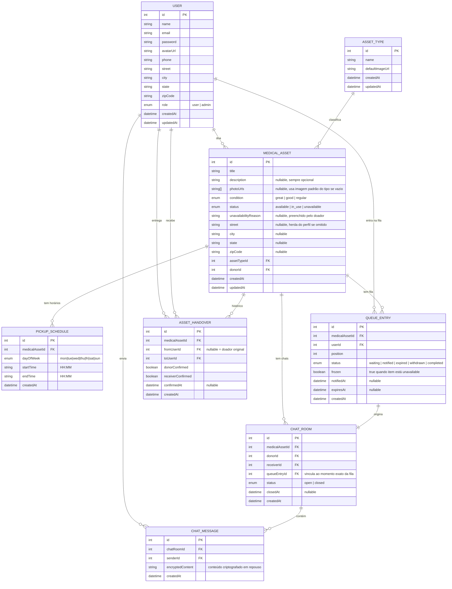

# 📐 SDD — Software Design Document

## Sarei e Doei

**Versão:** 1.3  
**Autor:** Lucas Aurélio  
**Data:** Abril 2026

---

## 1. Arquitetura Geral

```
sarei-e-doei/
├── apps/
│   ├── api/     ← NestJS REST API + WebSocket Gateway
│   └── web/     ← Vue.js 3 SPA
├── docs/
└── package.json ← NPM Workspaces
```

- **Backend:** API REST em NestJS com arquitetura modular + WebSocket Gateway para chat em tempo real
- **Frontend:** SPA em Vue.js 3 consumindo a API via HTTP e WebSocket com autenticação JWT
- **Banco:** PostgreSQL hospedado no Neon.tech
- **Deploy:** API no Render
- **Cron Jobs:** `@nestjs/schedule` para expiração automática de filas

---

## 2. Diagrama ER (Entidade-Relacionamento)



---

## 3. Módulos NestJS

| Módulo | Responsabilidade |
|---|---|
| `AuthModule` | Registro, login e emissão de JWT |
| `UsersModule` | Perfil e gerenciamento de usuários |
| `AssetTypesModule` | CRUD de tipos de equipamento (admin) |
| `MedicalAssetsModule` | CRUD de equipamentos, indisponibilidade e reativação |
| `PickupSchedulesModule` | Gerenciamento de horários de retirada |
| `QueueModule` | Gerenciamento de filas, congelamento e expiração via cron |
| `HandoverModule` | Transferências e histórico |
| `ChatModule` | Rooms de chat REST + WebSocket Gateway em tempo real |

---

## 4. Chat — Arquitetura e Criptografia

### Criptografia em Repouso

O chat utiliza **criptografia em repouso** (encryption at rest). As mensagens são criptografadas no backend antes de serem salvas no banco de dados, utilizando **AES-256-GCM** via a biblioteca nativa `crypto` do Node.js.

A chave de criptografia fica armazenada como variável de ambiente (`CHAT_ENCRYPTION_KEY`) e nunca é exposta no repositório. O servidor descriptografa as mensagens apenas no momento de entregá-las aos participantes autorizados do chat.

Esta abordagem foi escolhida em detrimento da criptografia ponta a ponta real (E2E) pelo escopo do MVP — E2E exigiria troca de chaves públicas entre clientes (protocolo Signal), aumentando significativamente a complexidade de implementação. E2E está previsto para versões futuras.

### Fluxo do Chat

1. Usuário é notificado que é sua vez na fila
2. Sistema cria automaticamente um `ChatRoom` vinculado ao `QueueEntry`
3. Doador e receptor se conectam via WebSocket autenticado com JWT
4. Mensagens trafegam em tempo real via WebSocket e são salvas criptografadas no banco
5. Quando ambos confirmam a transferência, o `ChatRoom` é fechado automaticamente (`status: closed`)
6. Cada item por solicitação tem seu próprio `ChatRoom` — nunca se misturam

---

## 5. Contratos da API

---

### 🔐 Auth

| Método | Rota | Descrição | Auth |
|---|---|---|---|
| POST | `/auth/register` | Cadastro de novo usuário | ❌ |
| POST | `/auth/login` | Login e retorno do JWT | ❌ |
| GET | `/auth/me` | Retorna usuário autenticado | ✅ User |

**POST /auth/register — Body:**
```json
{
  "name": "Alice Silva",
  "email": "alice@email.com",
  "password": "minimo6chars",
  "phone": "42999999999",
  "street": "Rua das Flores, 123",
  "city": "Guarapuava",
  "state": "PR",
  "zipCode": "85010000"
}
```

**POST /auth/login — Response:**
```json
{
  "accessToken": "eyJhbGci..."
}
```

---

### 👤 Users

| Método | Rota | Descrição | Auth |
|---|---|---|---|
| GET | `/users` | Lista todos os usuários | ✅ Admin |
| GET | `/users/:id` | Detalhe de um usuário | ✅ Admin |
| PATCH | `/users/me` | Atualiza perfil do usuário logado | ✅ User |
| PATCH | `/users/:id` | Atualiza qualquer usuário | ✅ Admin |
| DELETE | `/users/:id` | Remove usuário | ✅ Admin |

---

### 🏷️ Asset Types

| Método | Rota | Descrição | Auth |
|---|---|---|---|
| GET | `/asset-types` | Lista todos os tipos | ❌ |
| GET | `/asset-types/:id` | Detalhe de um tipo | ❌ |
| POST | `/asset-types` | Cria tipo de equipamento | ✅ Admin |
| PATCH | `/asset-types/:id` | Edita tipo | ✅ Admin |
| DELETE | `/asset-types/:id` | Remove tipo | ✅ Admin |

---

### 🩼 Medical Assets

| Método | Rota | Descrição | Auth |
|---|---|---|---|
| GET | `/medical-assets` | Feed público (available + in_use) | ❌ |
| GET | `/medical-assets/search` | Busca por nome ou tipo | ❌ |
| GET | `/medical-assets/unavailable` | Lista itens indisponíveis | ✅ Admin |
| GET | `/medical-assets/mine` | Meus itens cadastrados | ✅ User |
| GET | `/medical-assets/:id` | Detalhe do item | ❌ |
| GET | `/medical-assets/:id/history` | Histórico público censurado | ❌ |
| GET | `/medical-assets/:id/history/full` | Histórico completo com dados reais | ✅ Admin |
| POST | `/medical-assets` | Cadastra novo item | ✅ User |
| POST | `/medical-assets/:id/reuse` | Reutiliza item já cadastrado | ✅ User |
| PATCH | `/medical-assets/:id` | Edita item | ✅ User (dono) |
| PATCH | `/medical-assets/:id/unavailable` | Marca item como indisponível | ✅ User (dono) |
| PATCH | `/medical-assets/:id/reactivate` | Reativa item indisponível | ✅ Admin |

**GET /medical-assets/:id/history — Response (público, censurado):**
```json
[
  {
    "initials": "A. S.",
    "avatarUrl": null,
    "receivedAt": "2026-01-10T00:00:00.000Z",
    "returnedAt": "2026-01-25T00:00:00.000Z"
  }
]
```

**GET /medical-assets/:id/history/full — Response (admin):**
```json
[
  {
    "name": "Alice Silva",
    "avatarUrl": "https://...",
    "receivedAt": "2026-01-10T00:00:00.000Z",
    "returnedAt": "2026-01-25T00:00:00.000Z"
  }
]
```

---

### 📅 Pickup Schedules

| Método | Rota | Descrição | Auth |
|---|---|---|---|
| GET | `/medical-assets/:id/schedules` | Lista horários de retirada | ❌ |
| POST | `/medical-assets/:id/schedules` | Adiciona horário | ✅ User (dono) |
| PATCH | `/medical-assets/:id/schedules/:scheduleId` | Edita horário | ✅ User (dono) |
| DELETE | `/medical-assets/:id/schedules/:scheduleId` | Remove horário | ✅ User (dono) |

**POST /medical-assets/:id/schedules — Body:**
```json
{
  "dayOfWeek": "mon",
  "startTime": "18:00",
  "endTime": "20:00"
}
```

---

### 🔢 Queue

| Método | Rota | Descrição | Auth |
|---|---|---|---|
| POST | `/queue/:assetId/join` | Solicitar item (entrar na fila) | ✅ User |
| GET | `/queue/:assetId/position` | Ver minha posição na fila | ✅ User |
| GET | `/queue/:assetId/count` | Ver quantidade total na fila | ❌ |
| DELETE | `/queue/:assetId/leave` | Sair da fila | ✅ User |
| GET | `/queue` | Lista todas as filas | ✅ Admin |
| GET | `/queue/:assetId` | Fila completa de um item com nomes | ✅ Admin |

**GET /queue/:assetId/position — Response:**
```json
{
  "position": 2,
  "status": "waiting",
  "frozen": false
}
```

---

### 🤝 Handover

| Método | Rota | Descrição | Auth |
|---|---|---|---|
| POST | `/handover/:assetId/confirm-donor` | Doador confirma entrega | ✅ User (dono) |
| POST | `/handover/:assetId/confirm-receiver` | Receptor confirma recebimento | ✅ User |
| GET | `/handover` | Lista todas as transferências | ✅ Admin |
| GET | `/handover/:assetId` | Histórico de transferências do item | ✅ Admin |

---

### 💬 Chat (REST)

| Método | Rota | Descrição | Auth |
|---|---|---|---|
| GET | `/chat/rooms` | Lista meus chat rooms | ✅ User |
| GET | `/chat/rooms/:roomId` | Detalhe de um chat room | ✅ User (participante) |
| GET | `/chat/rooms/:roomId/messages` | Histórico de mensagens | ✅ User (participante) |

---

### 💬 Chat (WebSocket)

**Namespace:** `/chat`  
**Autenticação:** JWT via query param `?token=` ou header na conexão

| Evento (Client → Server) | Descrição |
|---|---|
| `joinRoom` | Entrar no chat room (`{ roomId }`) |
| `sendMessage` | Enviar mensagem (`{ roomId, content }`) |
| `leaveRoom` | Sair do chat room (`{ roomId }`) |

| Evento (Server → Client) | Descrição |
|---|---|
| `newMessage` | Nova mensagem recebida |
| `roomClosed` | Chat encerrado após confirmação de ambas as partes |
| `userJoined` | Outro participante entrou no room |

---

## 6. DTOs Principais

### RegisterDto
```typescript
{
  name: string        // obrigatório
  email: string       // obrigatório, formato e-mail
  password: string    // obrigatório, mín. 6 caracteres
  phone: string       // obrigatório
  street: string      // obrigatório
  city: string        // obrigatório
  state: string       // obrigatório
  zipCode: string     // obrigatório
}
```

### CreateMedicalAssetDto
```typescript
{
  title: string           // obrigatório
  description?: string    // opcional
  condition: string       // obrigatório: 'great' | 'good' | 'regular'
  assetTypeId: number     // obrigatório
  photoUrls?: string[]    // opcional
  street?: string         // opcional, herda do perfil se omitido
  city?: string
  state?: string
  zipCode?: string
}
```

### MarkUnavailableDto
```typescript
{
  unavailabilityReason: string  // obrigatório
}
```

### CreatePickupScheduleDto
```typescript
{
  dayOfWeek: string  // 'mon'|'tue'|'wed'|'thu'|'fri'|'sat'|'sun'
  startTime: string  // HH:MM
  endTime: string    // HH:MM
}
```

### SendMessageDto
```typescript
{
  roomId: number   // obrigatório
  content: string  // obrigatório, será criptografado antes de salvar
}
```

---

## 7. Regras de Negócio no Backend

- Endereço obrigatório: se ausente no perfil e no item, retorna `400 Bad Request`
- Usuário não pode solicitar o próprio item: retorna `403 Forbidden`
- Fila anônima: endpoint público de contagem nunca expõe IDs ou nomes
- Itens `unavailable` filtrados automaticamente nas rotas públicas
- Ao marcar `unavailable`: todas as `QueueEntry` do item recebem `frozen = true`
- Ao reativar: todas as `QueueEntry` recebem `frozen = false` e o primeiro `waiting` é notificado e um `ChatRoom` é aberto
- Expiração automática via **cron job** a cada hora — ignora entradas congeladas
- Transferência concluída apenas quando `donorConfirmed` e `receiverConfirmed` são `true`
- Ao concluir transferência: `ChatRoom` é fechado automaticamente
- Mensagens criptografadas com **AES-256-GCM** antes de salvar no banco
- Chave de criptografia via `CHAT_ENCRYPTION_KEY` no `.env`
- Apenas participantes do `ChatRoom` podem ler as mensagens
- Histórico censurado no backend: rota pública nunca retorna nome completo ou avatar real
- Contador de usos calculado via `COUNT` dos `AssetHandover` com ambas confirmações `true`
- Ao menos um `PickupSchedule` obrigatório ao publicar: retorna `400` se ausente

---

## 8. Segurança

- Senhas com hash **bcrypt**
- Autenticação via **JWT Bearer Token**
- Rotas REST protegidas por `JwtAuthGuard`
- WebSocket autenticado via JWT na conexão
- Rotas admin protegidas por `RolesGuard` com `@Roles('admin')`
- Mensagens do chat criptografadas com **AES-256-GCM** em repouso
- Variáveis sensíveis via `ConfigModule` (`.env`)
- `DATABASE_URL` e `CHAT_ENCRYPTION_KEY` nunca expostas no repositório
- Histórico censurado processado no backend
